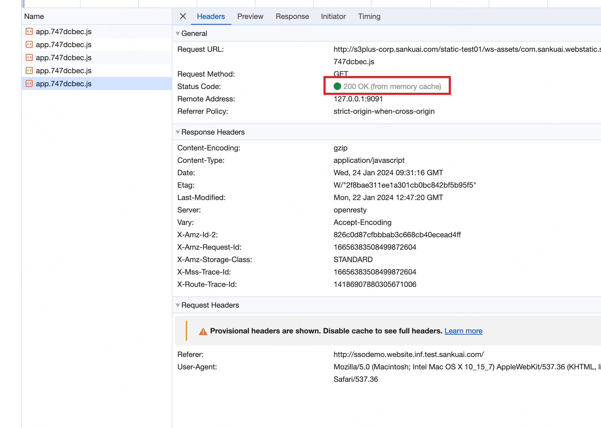
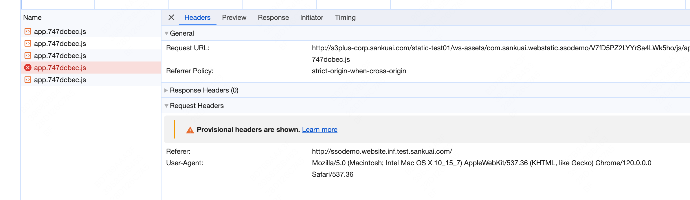

# 重新学习 HTTP 缓存

## 前言：缓存是什么

缓存是一种保存资源副本并在后续请求中重用该副本的机制，以减少网络延迟，提高性能，并减轻服务器的负载。在 Web 开发中，HTTP 缓存是指浏览器或代理服务器暂存网页资源的一种方式，如HTML文档、图片、文件等，以便在下次请求时快速提供。

"缓存"的原理简化到极致就是两个核心步骤：

1. **存：** 第一次请求某个 URL，浏览器收到响应，并"缓存下来"
2. **用：** 第二次请求同一个 URL，浏览器直接返回第一步所"存储"的响应内容

第二步就是口头上常讲的"走缓存"，走缓存时可以显著降低请求方的等待时间。但弊端也显而易见，如果一个旧版本的缓存一直不失效，新版本有变更时，老用户将无法访问到新版本的内容。

相信大家日常工作中都遇到过"你清下缓存试试"的问题，此类问题大概率都是由于缓存使用不当导致的。

本次分享的目的是带大家重新学习 HTTP 缓存，遇到缓存相关问题时可以定位、清晰的思路排查与定位缓存问题，并制定合适的缓存策略。

## 1 重新学习 HTTP 缓存

### 1.1 从 HTTP 1.0 到 HTTP 1.1

最初的 HTTP 1.0 版本协议只规定了简单的缓存机制，主要通过 Expires Header 控制缓存。Expires Header 的提供了一个时间戳，告诉浏览器资源什么时候过期，过期后需要从服务器重新获取。

```
Expires: Wed, 21 Oct 2015 07:28:00 GMT
```

这个机制的问题显而易见：Expires 的值是由服务端返回的时间戳，如果客户端与服务端的时钟有偏差，就可能产生非预期的效果。

HTTP 1.1 引入了更复杂的缓存控制策略，核心的就是 Cache-Control 头，它允许更精细的缓存控制，如指定资源是否可以缓存、可以缓存多长时间（max-age）、是否需要重新验证（must-revalidate）等。

```
Cache-Control: max-age=0
Cache-Control: max-age=3600, s-maxage=60
Cache-Control: max-age=0, must-revalidate
Cache-Control: no-cache
```

以下是一些最常见的 Cache-Control 指令及其含义：

- `max-age=<seconds>`: 指定一个时间长度，在这段时间内，缓存是**新鲜的**，可以直接使用，而无需去服务器重新验证。
- `no-cache`: 禁止直接使用缓存，要求缓存每次在提供给客户端之前，必须去服务器**验证其有效性**。
- `no-store`: 禁止缓存存储任何版本的资源，每次请求都会从服务器下载完整的资源。
- `public`: 表示响应可以被任何缓存区缓存，包括浏览器和中间代理服务器等。
- `private`: 响应只能被单个用户的浏览器缓存，不适用于共享缓存。
- `must-revalidate`: 一旦资源过期（比如超过了max-age），缓存必须去服务器验证资源的有效性，即使用户在离线状态下也是如此。

### 1.2 max-age 缓存

max-age 是 Cache-Control 最常用也最容易理解的指令，顾名思义就是制定了缓存的"有效时长"。

举例说明，假设有一个Web页面，其HTTP响应 Header 包含以下Cache-Control指令：

```
Cache-Control: public, max-age=3600
```

这意味着该资源可以被公开缓存，且在3600秒（1小时）内都被认为是新鲜的。

**首次请求存储缓存**

用户第一次访问这个页面时，浏览器会向服务器发送请求并下载资源，同时根据响应 Header 的Cache-Control指令将资源存储在缓存中。由于指定了max-age=3600，这个资源在接下来的1小时内都是新鲜的，可以直接从缓存中获取。

**二次访问使用缓存**

在接下来的1小时内，如果用户再次访问同一个页面，浏览器会检查缓存中的资源是否新鲜。由于资源在max-age指定的时间内，浏览器会直接从缓存中加载资源，而不会向服务器发送请求，这样可以加快页面加载速度并减少服务器负载。

**二次访问缓存过期**

如果超过了1小时，用户再次访问页面，浏览器会发现缓存中的资源已经不再新鲜。此时，浏览器会向服务器发送**条件请求**，通常包含If-None-Match（对应ETag）或If-Modified-Since（对应Last-Modified） Header ，以检查资源是否有更新。如果资源没有更改，服务器会返回304状态码，**浏览器会继续使用缓存中的资源（重新将资源在缓存中存一遍，并设定 max age）**，否则服务器会发送新的资源以及更新的缓存控制指令。

### 1.3 启发式缓存

启发式缓存是指在HTTP响应中没有明确的缓存过期信息时，浏览器或代理服务器使用一定的算法来估算资源的新鲜度，并决定资源的缓存时间。这种情况通常发生在服务器没有提供Cache-Control或Expires Header 的情况下。

**何时生效**

当HTTP响应中缺少明确的指示缓存行为的 Header （如Cache-Control和Expires）时，浏览器可能会根据响应的其他信息，如Last-Modified Header ，来计算缓存的有效期。一种常见的启发式方法是使用响应时间（例如，当前时间）和 Last-Modified 时间的差值的一部分来估算 max-age。

"启发式缓存"的过期时间 HTTP 协议**没有明确的规定**，但建议采用如下公式：

```
(收到响应的时间 - LastModified 时间) * 10%
```

**优点**

- **自动缓存**: 启发式缓存允许浏览器在没有明确缓存指令的情况下自动缓存资源，这可以提高网页加载速度并减少服务器负担。
- **后备策略**: 对于没有正确配置缓存 Header 的服务器，启发式缓存提供了一种后备机制，确保资源仍然可以得到一定程度的缓存。

**缺点**

- **不精确**: 启发式缓存可能不会反映服务器的真实意图，因为它基于一种算法而不是服务器明确的指示。
- **可能过时**: 由于启发式缓存是基于估算的，可能导致用户看到过时的内容，特别是如果资源频繁更新但服务器未提供明确的缓存控制 Header 时。
- **一致性问题**: 不同的浏览器和代理服务器可能使用不同的启发式算法，导致缓存行为的不一致性。

**例子：** 访问截图中的页面，会触发 app.xxx.js 资源的请求。



第一次请求后的响应来自服务器，没有包含Cache-Control或Expires Header ，响应中包含一个Last-Modified Header，其值为1月22号晚上 20:47 分，即大约2天前。浏览器可能使用一个算法，例如取Last-Modified时间与当前时间差的10%作为缓存时间。如果资源在2天前最后修改，浏览器可能会估算资源的新鲜度为0.2天（即大约4.8小时）。在这个时间内，如果有新的请求，浏览器会直接从缓存中提供资源，而不会去服务器进行验证。

因此，为了更精确地控制资源的缓存行为，最佳实践是服务器明确提供Cache-Control和/或Expires Header 指令。

### 1.4 缓存过期后 - 条件请求

无论缓存的方式是启发式缓存、max-age 缓存还是更老的 Expires 缓存，对于浏览器来说，都会给自己所存储的缓存内容设定一个"过期时间"。当过了该时间，就认为这份缓存"过期"了。

但与大家直观认识的不同，过期的缓存并不会被直接丢弃。HTTP 有一种机制，可以通过询问源服务器将陈旧的响应转换为新的响应。这称为验证，有时也称为重新验证。

浏览器"重新验证"的方式就是携带 If-Modified-Since 或 If-None-Match 请求标头，再次向服务器发起请求，这种请求称作「条件请求」。

条件请求的结果有两类：

- **200 OK**：返回新的响应内容，并重新设置缓存
- **304 Not Modified**：服务端只会返回空的 Body，代表资源内容没有变更，浏览器依然会从缓存区取出原来的响应内容

在网上比较常见到"强缓存"与"协商缓存"的说法，如果按照这种说法，当“条件请求”的结果为 304 时，就属于这种所谓的 “协商缓存”。但实际上所谓"协商缓存"可能只是民间俗称的、非官方的概念，在 [HTTP 协议的标准](https://datatracker.ietf.org/doc/html/rfc7232)中，唯一规定了 HTTP 304 的场景是 Conditional Requests（条件请求）部分。

同样地，RFC 标准中也从来没有出现过 “强缓存” / Strong Cache 这样的概念。“强缓存”与“协商缓存” 只是看上去比较像样，又方便记忆的一对名词。但严格来说是伪概念，甚至错误的。

### 1.5 浏览器的 back/forward 缓存

除了标准的 HTTP 缓存之外，浏览器还有一种特殊的缓存机制，称为 back/forward 缓存（BFCache）。它允许用户在点击浏览器的后退和前进按钮时，快速加载之前访问过的页面。与传统的HTTP缓存不同，BFCache不仅缓存页面的数据，可能还缓存了页面的DOM状态、阅读进度条等数据，这意味着整个页面（包括滚动位置、表单状态等）可以被完整地恢复，而无需重新执行JavaScript代码或重新渲染页面。

但 BFCache 的存储在一定程度上受到 Cache-Control 响应头的影响：如果 Cache-Control 设置了 `no-store`，那么浏览器完全不会保存缓存，也会导致前进后退缓存无法使用。

## 2 常见误区

### 2.1 开发者认为自己可以用编程的方式清除客户端 HTTP 缓存

**正解：不能。**

根据 HTTP 协议的标准，如果客户端存储了某资源的缓存，并且标记为"新鲜"，那么在存储缓存时设定的"新鲜度"失效前，开发者无法直接清除。只能通过设置新的缓存策略来影响后续的缓存行为。

### 2.2 认为 HTML 主文档一定不能缓存

**正解：可以。**

理论上任何 HTTP 请求都可以被缓存，与文件类型没有关系。

但为什么会有这个误区呢？多数原因还是因为项目的 HTML 是用户访问项目的唯一入口，给 HTML 加缓存后会导致发版延迟。例如项目发布了有 bug 的 A 版本，而访问了 A 版本的用户已缓存了旧的 HTML，就无法及时获取修复版。

### 2.3 认为浏览器缓存的只有响应 Body，没有其他的内容

**正解：** 浏览器不只会缓存响应 Body，也会将收到的响应的标头，例如 `Access-Control-Allow-Origin` 响应头一并缓存。

**演示：** 以下截图中的 app.747dcbec.js，在首次请求时并没有收到 Access-Control-Allow-Origin Header（或者也可以说：收到的该请求头值为空）。在后续触发重复请求时，浏览器也使用了它的缓存 —— 在使用缓存时不仅取了缓存的 body，也取了缓存的 header，包括 Access-Control-Allow-Origin 的 Header 值（空），导致触发了 CORS 报错（图中红色请求）。



## 3 最佳实践

缓存是一把双刃剑，如果合理分析、合理使用，可以大幅提高页面与资源加载性能。如果使用不当也可能带来严重的程序 Bug。

以下是一些与缓存相关的业务的最佳实践：

**1. 学会正确使用工具分析缓存**

使用 Chrome DevTools 的 Network 工具判断是否走了缓存。

**2. 尽量避免使用 Last-Modified，而应当明确使用 Cache-Control 响应头**

根据原理，当使用 Last-Modified 响应头时，会触发浏览器的启发式缓存，而启发式缓存的时间非常不准确，且大众认知度较低。要避免该响应头，避免产生不必要的缓存行为。

**3. 流量特别大业务的静态 HTML 页面，Cache-Control 可适当设置一定的 max-age 周期**

基于常见误区1，只要页面可以接受一定时间内的版本刷新延迟，HTML 页同样可以设置一定的缓存时间，以加速用户访问。

**4. 给静态资源的打包文件名加上 hash 值**

现代 Web 前端项目几乎都采用 Webpack/Vite 等工具进行构建，通过合理的配置，将打包产物的文件名带上哈希值（只要内容有变更，哈希值就会变化），可以使每次部署的资源 URL 唯一，配合长缓存策略使用。

**5. 尽量开启 HTTP 304 功能**

HTTP 304 可以使浏览器在本地缓存过期后，发起"条件请求"时，直接响应 304 状态码而无需返回完整的 body，对于 body 较大（几百 KB、几MB 等）的场景可以减少下载时长、减少服务端带宽消耗。

**6. 尽量避免使用 no-store**

有些项目在遇到缓存导致的问题之后，会武断地将缓存视为洪水猛兽，直接将 Cache-Control 设置为 no-store。但如此设置，也会使得用户浏览器前进、后退等操作时，也无法使用 BFCache，对用户体验并不好。

在大多数情况下，使用 `no-cache` 即可满足多数项目希望排除缓存影响的诉求。

## 4 参考

- [Cache-Control - HTTP | MDN](https://developer.mozilla.org/en-US/docs/Web/HTTP/Headers/Cache-Control)
- [HTTP 缓存 - HTTP | MDN](https://developer.mozilla.org/zh-CN/docs/Web/HTTP/Caching)
- [RFC 7232 - Hypertext Transfer Protocol (HTTP/1.1): Conditional Requests](https://datatracker.ietf.org/doc/html/rfc7232)
- [RFC 9111: HTTP Caching](https://www.rfc-editor.org/rfc/rfc9111)
