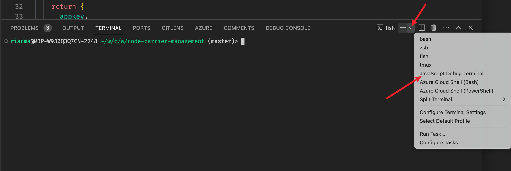
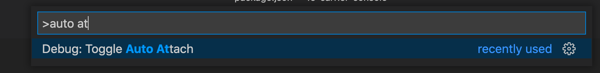
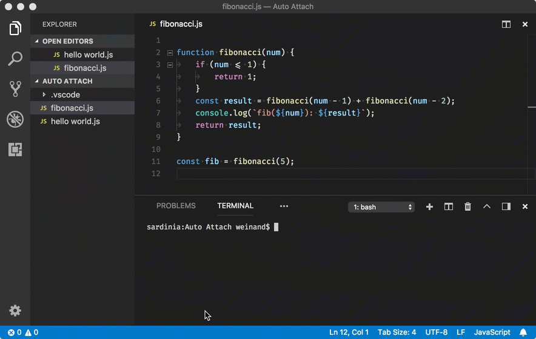
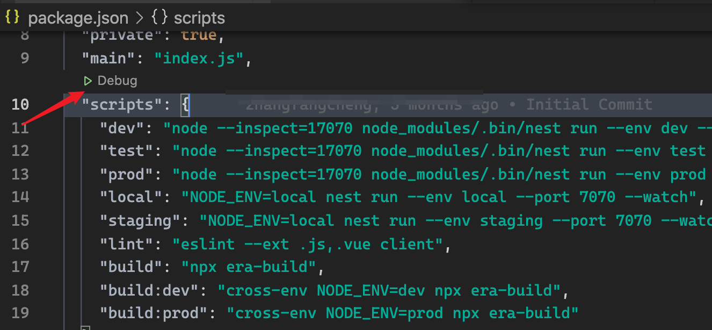
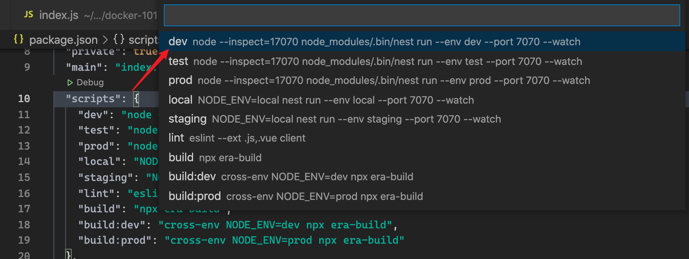
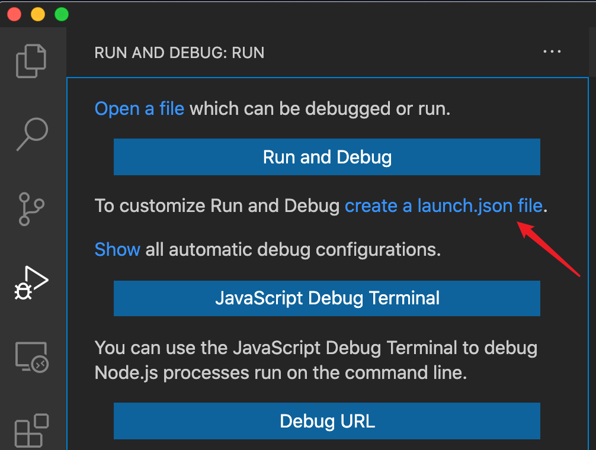
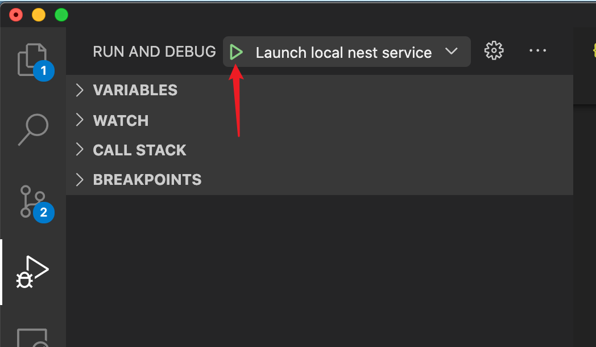
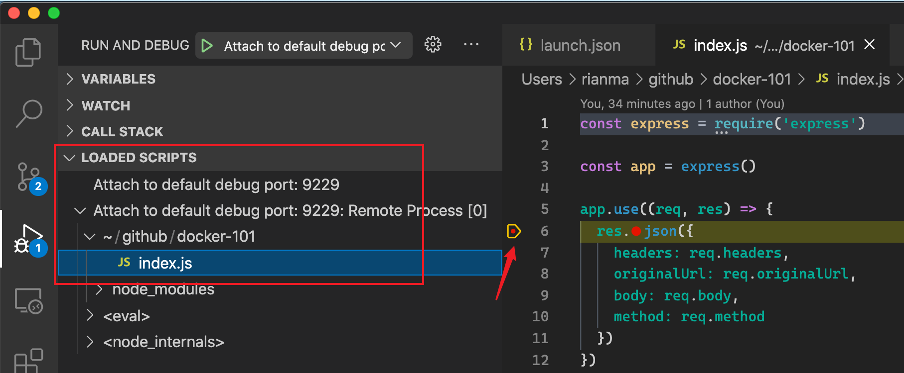

# Node.js 调试指南

Node.js（>= v6.3.0）支持以调试模式启动 Node 进程，并使用 VS Code 编辑器或 Chrome Devtools 进行调试。支持实时断点、查看函数调用堆栈、Watch 变量和交互式 REPL 等特性。

以下文档、blog 可以作为参考：

- [Node.js 官方文档：Debugging Node.js](https://nodejs.org/en/learn/getting-started/debugging)
- [Paul Irish：Debugging Node.js with Chrome DevTools](https://medium.com/@paul_irish/debugging-node-js-nightlies-with-chrome-devtools-7c4a1b95ae27)
- [VS Code 官方帮助文档：Node.js debugging in VS Code](https://code.visualstudio.com/docs/editor/debugging)

## 调试本地进程

### 懒人版 1 - 直接使用 JavaScript Debug Terminal 启动 node 进程

VS Code 自带的终端 Terminal 可以方便地执行任意 Shell 命令，其中 **JavaScript Debug Terminal** 可以非常灵活地启动一个能够自动开启调试模式的 Terminal。

**使用方式：**

1. 点击菜单栏的 Terminal -> New Terminal（按 `Ctrl + Shift + `` 快捷键）打开新的 Terminal
2. 点击下方 Terminal 区域右上角 `+` 图标右侧的 `↓` 图标，选择下拉框中的 **JavaScript Debug Terminal**

    

3. 在新的 Terminal 中直接执行 node 命令即可，VS Code 会自动附加调试器并在调试面板中显示变量、调用栈等信息。

### 懒人版 2 - 开启 VS Code 的 Auto Attach 功能

Auto Attach 是 VS Code 为了应对调试配置繁琐问题提供的特性，打开 Auto Attach 开关后，VS Code 可以自动识别在集成终端中使用 `node --inspect` 启动的进程，并启动 debugger。

这种方式非常适用于初学者编写简单的 Node 脚本后的运行和调试，同时对于复杂进程的临时性调试也同样适用。

**使用方式：**

1. 在 VS Code 的控制面板中（按 `Cmd + Shift + P` 快捷键）打开 Toggle Auto Attach 开关

    

2. 在 VS Code 的终端中使用 `node --inspect` 执行 node 命令

    

参考 VS Code 的特性发布 blog：[Introducing Logpoints and auto-attach](https://code.visualstudio.com/blogs/2018/07/12/introducing-logpoints-and-auto-attach#_npm-scripts-and-debugging)

### 懒人版 3 - VS Code 自动识别 npm scripts 启动调试

VS Code 提供了"开箱即用"的傻瓜式 Node.js 调试功能，并且贴心地在 `package.json` 的 scripts 中展示了快速入口。

**使用方式：**

1. 点击 `package.json` 文件中 scripts 旁边出现的 Debug 按钮

    

2. 在弹出任务列表中，选择要调试的任务

    

这种调试方式**适用于：**

- 简单易用，不需要配置复杂的文件
- 需要直接调试某个 npm script 的执行过程

**缺点：**

- 不能支持定制选项，例如运行时参数、指定环境变量配置等
- 与 npm script 绑定，没有定义 npm script 任务则不能调试

### 高级定制版 - 使用 launch.json 中编写 launch 调试任务

需要在调试前传入自己需要的运行时参数、环境变量，就需要自己编写 VS Code 的 `launch.json` 配置文件，在配置文件中定义详细的任务。

**使用方式：**

1. 打开 VS Code 窗口的 Debug 菜单，点击 **create a launch.json file**

    

2. 在 `launch.json` 配置文件的 `configurations` 字段中新增一个配置项：

    ```json
    {
      "type": "node",
      "request": "launch",
      "name": "Launch local nest service",
      "runtimeArgs": [
          "--inspect=17070",
          "${workspaceFolder}/node_modules/.bin/nest",
          "run",
          "--env",
          "local",
          "--port",
          "7070",
          "--watch"
      ],
      "console": "internalConsole",
      "internalConsoleOptions": "neverOpen",
      "env": {},
      "envFile": "${workspaceFolder}/.env",
      "skipFiles": [
          "<node_internals>/**"
      ],
      "cwd": "${workspaceFolder}",
      "port": 17070
    }
    ```

    以上配置等价于执行以下命令：

    ```shell
    node --inspect=17070 node_modules/.bin/nest run --env local --port 7070 --watch
    ```

3. 保存 `.vscode/launch.json` 后，点击开始图标启动调试

    

**launch 任务配置说明：**

- `type`: `node`
- `request`: `launch`
- `name`: 任务名称，可自定义
- `runtimeArgs`: 运行时参数，字符串数组，会被转为 node 命令的参数
- `cwd`: 指定 node 进程执行的上下文目录
- `envFile`: 指定 .env 文件路径，自动加载环境变量

### 独立调试版 - Attach 到独立执行的进程进行调试

这种方式需要先后独立执行启动 Node 进程和启动调试进程两个步骤。

1. 被调试的 node 进程在启动时，需要打开"调试模式"，有以下两种方式：

    a. 在启动 node 进程时，指定 `--inspect` 参数：

    ```shell
    # 在 localhost:17070 监听调试进程
    node --inspect=17070 node_modules/.bin/nest run --env dev --port 7070

    # 或者在 0.0.0.0:17070 监听调试进程（用于远程调试）
    node --inspect=0.0.0.0:17070 node_modules/.bin/nest run --env dev --port 7070
    ```

    b. 通过 kill 命令，向 node 进程发送 `SIGUSR1` 信号：

    ```shell
    # 首先找到被调试进程的 PID
    ps aux | grep node

    kill -usr1 78797
    ```

2. 打开 `.vscode/launch.json`，在 `configurations` 列表中新增一个 attach 类型的调试任务：

    ```json
    {
      "type": "node",
      "request": "attach",
      "address": "localhost",
      "port": 17070,
      "name": "Attach local nest service",
      "restart": true
    }
    ```

3. 启动调试进程后，在左侧的 "Loaded Scripts" 中查找进程已加载的代码，并打断点调试

    

这种调试方式**适用于：**

- 被调试的进程已经启动，不方便关掉进程再重新在 VS Code 中使用 launch 方式启动
- 对于使用了 nodemon 等工具监听源代码变化、自动重启 Node 进程的场景，通过 attach 的方式调试，可以无需反复点击"开始调试"按钮
- 以这种方式启动的进程，还可以使用 Chrome 浏览器的 Devtools 进行调试

**缺点：**

- 要调试的源代码不在 VS Code 编辑器中，只能通过只读的方式在左侧的 Loaded Scripts 中打开，所以不能事先打断点

## 调试远程进程

要调试远程进程（非本地运行的 Node.js 进程），方法与 Attach 到本地 Node.js 进程是相同的。但有以下几个额外的前提条件：

1. 需要保证被调试的进程使用 `--inspect` 参数启动，并且参数配置为 `0.0.0.0` 而不是默认的 `localhost`：

    ```shell
    node --inspect=0.0.0.0:8080 index.js
    ```

2. 在 `launch.json` 配置文件中把 `address` 字段修改为被启动的 Node.js 进程所运行的主机地址：

    ```json
    {
      "type": "node",
      "request": "attach",
      "address": "192.168.1.100",
      "port": 8080
    }
    ```
