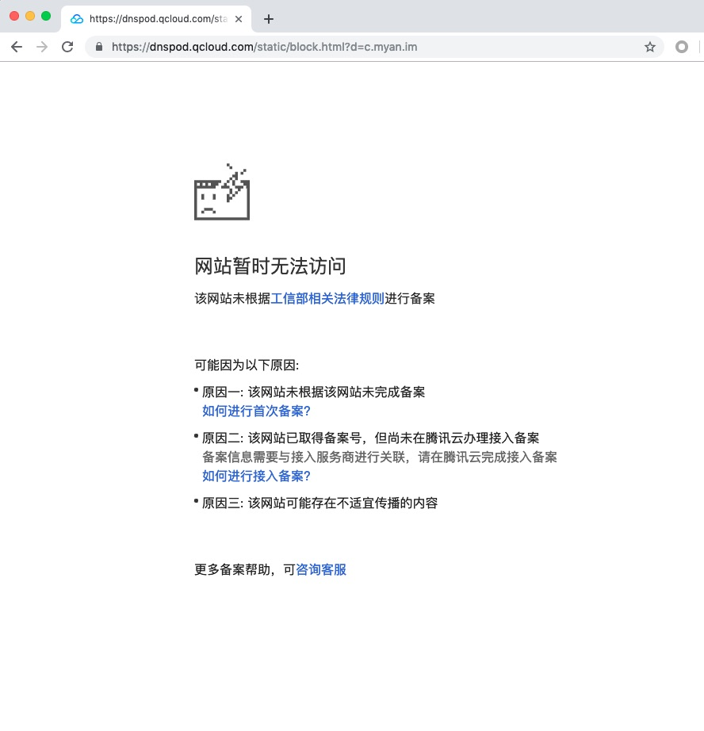
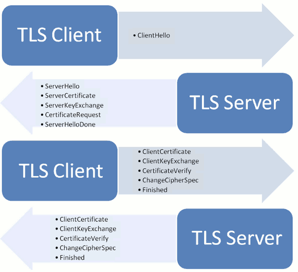
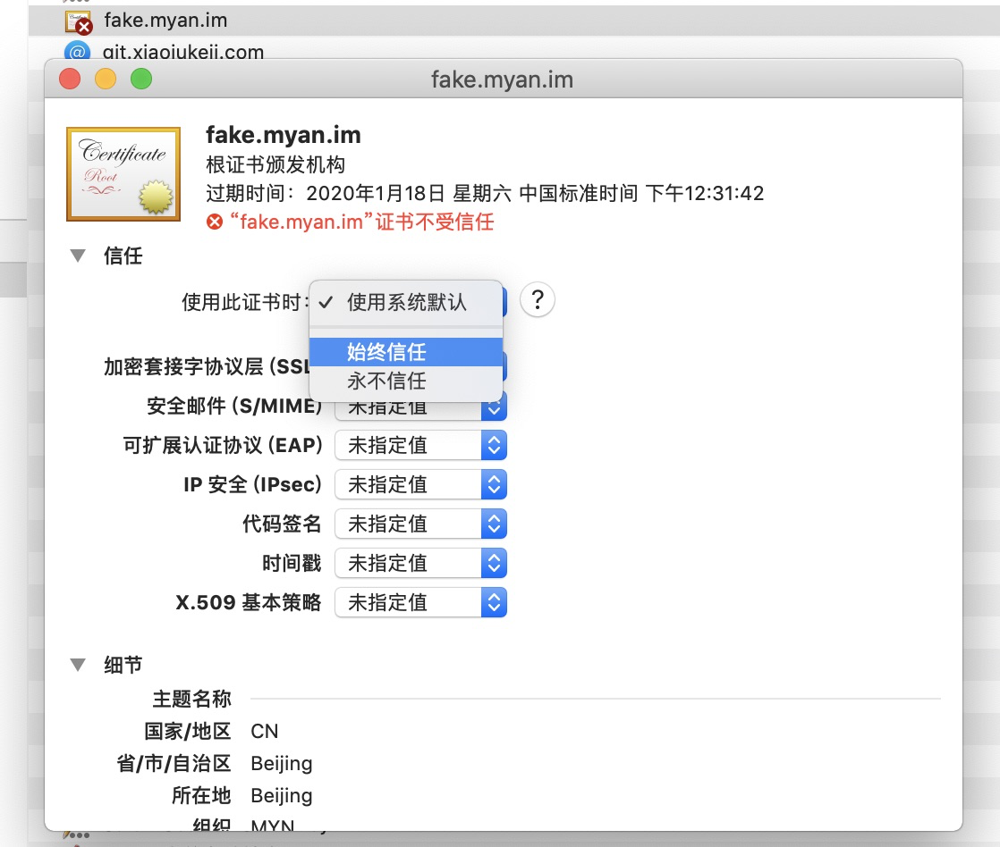
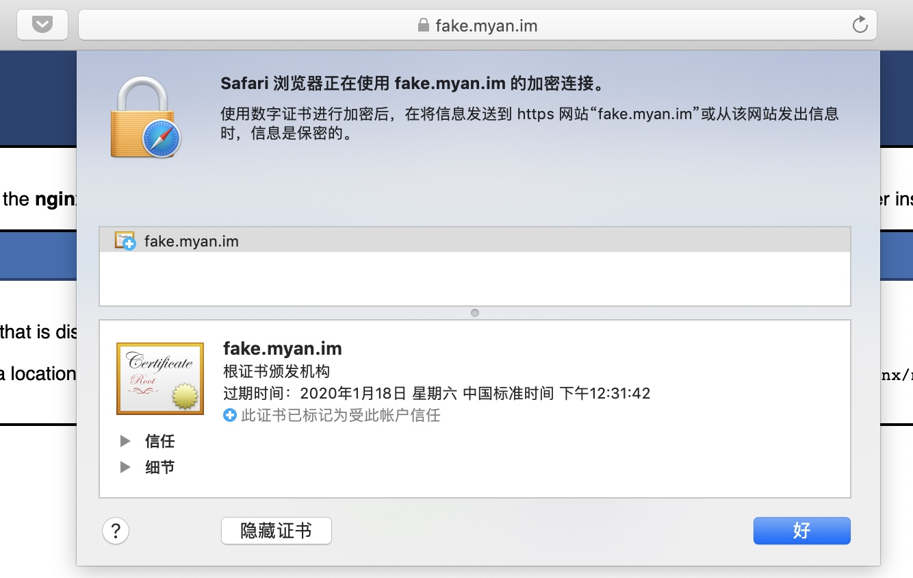
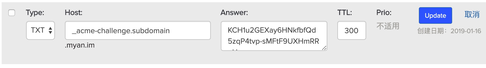
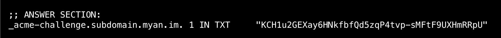
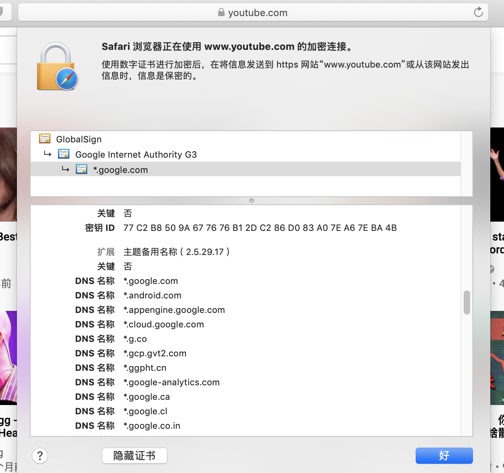

2018 年的最后一个月，我终于决定给自己 3 年前申请了域名的个人网站搞个 SSL 证书，让网站上车 HTTPS。免费、适合个人网站（玩票）的 SSL 证书方案，首选 Let’s Encrypt。但是与一开始「一小时搞定」的预期不同，最终完成整件事情花了我一个周末的时间，还是有必要记录下来。

## 背景

当然 HTTPS 是大势所趋，但因为懒自己并没有真正地搞过 SSL 证书、部署 HTTPS 网站。终于痛下决心部署 HTTPS 是源于自己把网站部署在了国内的腾讯云主机上，而因为我域名没有在国内备案，导致使用域名访问时被腾讯云限制不可访问。

从个人开发者手动部署一个可运行网站的方案说起：

1.  事先准备
    -   一个可通过公网 IP 访问的云主机作为服务器，以我个人云主机 IP 为例：118.24.121.85
    -   在域名商所购买的域名，以我个人域名为例：myan.im
2.  通过 ssh 登录到服务器，手动安装并启动 Nginx 服务
3.  在域名商网站上添加一条 A 类型的 DNS 记录，将域名 c.myan.im 指向以上 IP 地址
    -   配置成功后，通过 ping 命令即可检查 DNS 生效

完成第 2 步后，我们就已经可以通过 IP 和端口（默认 80）直接访问网站，验证也通过。

```sh
curl http://118.24.121.85
```

完成第 3 步后，本来期望的表现是访问 `http://c.myan.im` 也有同样的表现，但很不幸：



通过 curl 检查也可发现，http 请求返回的是 302 头，Location 头为 [https://dnspod.qcloud.com/static/block.html?d=c.myan.im](https://dnspod.qcloud.com/static/block.html?d=c.myan.im)

```sh
> curl http://c.myan.im -v

< HTTP/1.1 302
< Location: https://dnspod.qcloud.com/static/block.html?d=c.myan.im
```


总算见识到了网站不备案的后果！可见我们把个人网站域名解析到国内主机，没有问题。但如果网站没有备案，对不起门都不让你进🤷。

至于技术上如何实现，其实这就是典型的 HTTP 劫持问题，站在腾讯云的角度思考：

1.  HTTP 请求发起，路由到 Web Server 的服务器 IP，要经过腾讯云的网络
2.  请求链路到达腾讯云主机前，腾讯云**可以** 获取 HTTP 请求详情
3.  腾讯云读取报文 Host，检查是否备案；如未备案，则直接返回 302 重定向状态，请求未触发服务器相应的 IP:PORT
4.  浏览器收到 302 并跳转到 Location 指定地址

问题出现在第 3 步，因为 HTTP 是明文传输协议，意味着不光腾讯云，甚至客户端到服务端网络链路上的任何一个环节，都**可以**读取 HTTP 报文内容。

HTTP 劫持案例

1.  运营商劫持网页，插入流量包广告
2.  Charles 代理修改请求，修改返回值
3.  路由器修改 User-Agent 头，导致 bug

## HTTPS 反劫持

### 原理

从基本原理上讲，HTTPS 可以说是 HTTP 与 SSL/TLS 协议的结合。在进行应用层的报文传输前，要通过 TLS 协议建立加密会话。



当然这个图的握手原理并不是本文的重点，我们关注的是所谓**证书**在 SSL 连接中的作用。在 Let’s Encrypt 的工具 certbot 文档页，他们这样解释什么是证书：

> A public key or digital _certificate_ (formerly called an SSL certificate) uses a public key and a private key to enable secure communication between a client program (web browser, email client, etc.) and a server over an encrypted SSL (secure socket layer) or TLS (transport layer security) connection. The certificate is used both to encrypt the initial stage of communication (secure key exchange) and to identify the server. The certificate includes information about the key, information about the server identity, and the digital signature of the certificate issuer. If the issuer is trusted by the software that initiates the communication, and the signature is valid, then the key can be used to communicate securely with the server identified by the certificate. Using a certificate is a good way to prevent “man-in-the-middle” attacks, in which someone in between you and the server you think you are talking to is able to insert their own (harmful) content.

可以总结为以下几点：

-   证书使用一个密钥对（公钥、私钥）用来加密客户端与服务端通信
-   证书作用包括：通讯初始化阶段加密、表明服务器身份
-   证书包含了公钥信息、服务器身份信息，以及证书签发者签名

除了我们日常在浏览器中访问 HTTPS 网站，可以在点击地址栏左侧看到正在访问网站的 SSL 证书，还有这些案例，我们可以感知到证书的存在的：

-   多年前的 12306 需要自己下载证书、安装证书
-   采用 EAP-PEAP 认证的企业 WiFi 办公网络，在客户端（如手机）连上 WiFi 后，操作系统会提醒我们安装公司企业证书并信任，这样一来客户端就可以访问该证书保护的内网（Intranet）HTTPS 网站
-   iOS 安装企业 App，信任证书后，可以绕过 App Store 安装应用

### 获取自签名 SSL 证书

从自签名证书说起：我们可以自己签名，自己生成一个证书，并在 nginx 部署。

浏览器一样会发起请求，但在与服务器端建立安全套接层过程中，浏览器会认为该证书不可信任。理论上：我们可以把自己的证书，内置在浏览器中，就可以解决这个问题。

* * *

以下是实践步骤：

1.  生成 key 与证书
    
    ```sh
    openssl req -newkey rsa:2048 -nodes -keyout key.pem -x509 -days 365 -out certificate.pem
    ```
    
    > 该命令生成的证书是 CA 根证书，使用
    
2.  检查证书
    
    ```sh
    openssl x509 -text -noout -in certificate.pem
    ```
    
3.  有了证书文件、key 文件后，就可以在 nginx 里使用如下配置，启用 HTTPS 支持，并监听 443 端口：
    
    ```plain
    server {
        listen       80;
        listen       443 ssl;
        server_name  fake.myan.im;
        root         /usr/share/nginx/html;
    
        ssl on;
        ssl_certificate /path/to/certificate.pem; # 证书文件路径
        ssl_certificate_key /path/to/key.pem; # key 文件路径
        error_page 404 /404.html;
        location = /40x.html {
            root   html;
        }
    
        location / {
        }
    
        # redirect server error pages to the static page /50x.html
        error_page   500 502 503 504  /50x.html;
        location = /50x.html {
            root   html;
        }
    }
    ```
    
    其后，使用通过 `sudo systemctl restart nginx` 命令重启 nginx 进程。
    
4.  浏览器访问 [https://fake.myan.im](https://fake.myan.im) 被浏览器告警：证书无效
    
5.  scp 下载证书文件到本地，并双击打开证书文件，安装并信任该证书
    
    ```sh
    # remote.host 为远程主机地址
    # ~/local/path 为本地下载目录
    scp remote.host:/path/to/certificate.pem ~/local/path
    ```
    
    
    

使用 Safari 浏览器查看，即发现已经可以访问了。



> 如果使用 Chrome 浏览器访问，会发现还是会证书错误。这是因为 Chrome 58 后的版本，对自签名证书的安全性要求更高，需要更复杂的自签名过程。参考 [https://serverfault.com/questions/845766/generating-a-self-signed-cert-with-openssl-that-works-in-chrome-58](https://serverfault.com/questions/845766/generating-a-self-signed-cert-with-openssl-that-works-in-chrome-58)

## 真实世界里的证书申请和使用

现在我们知道，自签名证书也好，真实有含金量的真实证书也好，归根结底都只是一个证书文件。我们需要把它放在我们的主机上，再配置一下 nginx 使用这个证书来 Serve HTTPS 服务。

免费的证书最流行的选择是 Let’s Encrypt，由国内云服务商也有自己配套的 SSL 证书可使用，但 Let’s Encrypt 胜在足够通用。其限制是默认只有 3 个月有效期，到期后需要重新 renew 操作。

> 要了解 Let’s Encrypt 的工作原理，参考：[How It Works - Let’s Encrypt - Free SSL/TLS Certificates](https://letsencrypt.org/how-it-works/)

> 关于 Let’s Encrypt 常见问题，参考：[FAQ - Let’s Encrypt - Free SSL/TLS Certificates](https://letsencrypt.org/docs/faq/)。

Let’s Encrypt 提供的核心服务是证书颁发的基础服务，很多第三方服务在此基础上做了封装，给用户提供免费证书服务。一个典型的例子是我们很多人耳熟能详的 Github Pages 服务，Github Pages 支持绑定自定义的域名，启用域名绑定后无需用户自行配置，就可以通过 https:// 协议访问。

要手动获取证书，并自行部署 HTTPS，Let’s Encrypt 推荐使用 eff.org 的命令行工具 [Certbot](https://certbot.eff.org/)。

### 安装 certbot-auto 命令行

> TL;DR：不要使用 yum 安装的包，wget 下载脚本即可

参考 [https://certbot.eff.org/docs/install.html](https://certbot.eff.org/docs/install.html) 说明文档，直接把命令行工具下载到本地。

```bash
> wget https://dl.eff.org/certbot-auto
> chmod a+x ./certbot-auto
> ./certbot-auto --help
```

### 使用 certbot 自动模式获取指定域名证书

certbot 有自动模式，可以帮 nginx，apache 等服务器自动生成证书文件并配置网站。

我们以 real.myan.im 为例，示范如何获取该域名的证书。

1.  首先需要配置 http 服务，关键配置如下。在 conf.d 目录下新建文件，并重启 nginx 服务
    
    ```plain
    server {
        listen       80;
        server_name  real.myan.im;
        root         /usr/share/nginx/html;
    
        location / {
        }
    }
    ```
    
2.  执行 certbot-auto 命令，默认即会使用自动模式进入 CLI 交互
    
3.  ```plain
    ~ > ./certbot-auto
    ```
    
    依次选择指定域名，以下是交互式输出：
    
    ```plain
    Which names would you like to activate HTTPS for?
    - - - - - - - - - - - - - - - - - - - - - - - - - - - - - - - - - - - - - - - -
    1: g.myan.im
    2: real.myan.im
    3: v.myan.im
    - - - - - - - - - - - - - - - - - - - - - - - - - - - - - - - - - - - - - - - -
    Select the appropriate numbers separated by commas and/or spaces, or leave input
    blank to select all options shown (Enter 'c' to cancel): 2
    Obtaining a new certificate
    Performing the following challenges:
    http-01 challenge for real.myan.im
    Waiting for verification...
    Cleaning up challenges
    Deploying Certificate to VirtualHost /etc/nginx/conf.d/real.conf
    
    Please choose whether or not to redirect HTTP traffic to HTTPS, removing HTTP access.
    - - - - - - - - - - - - - - - - - - - - - - - - - - - - - - - - - - - - - - - -
    1: No redirect - Make no further changes to the webserver configuration.
    2: Redirect - Make all requests redirect to secure HTTPS access. Choose this for
    new sites, or if you're confident your site works on HTTPS. You can undo this
    change by editing your web server's configuration.
    - - - - - - - - - - - - - - - - - - - - - - - - - - - - - - - - - - - - - - - -
    Select the appropriate number [1-2] then [enter] (press 'c' to cancel): 2
    Redirecting all traffic on port 80 to ssl in /etc/nginx/conf.d/real.conf
    
    - - - - - - - - - - - - - - - - - - - - - - - - - - - - - - - - - - - - - - - -
    Congratulations! You have successfully enabled https://real.myan.im
    
    You should test your configuration at:
    https://www.ssllabs.com/ssltest/analyze.html?d=real.myan.im
    ```
    
4.  访问 [https://real.myan.im](https://real.myan.im) 见证奇迹
    

certbot 工具自动模式，帮助我们傻瓜式地完成了证书申请、网站所有权验证、nginx 配置三个过程。

输出文件保存在指定目录下，其中最重要的证书文件和私钥文件，我们可以保存到其他地方。

### certbot 脚本执行原理

要了解自动模式的工作原理，我们要来读一下 log 输出。

首先自动模式会去读取 nginx 已有的网站配置，需要依赖我们实现配置好 http 格式的 Web 服务。

自动模式下，有一个自动完成的步骤：

```plain
Performing the following challenges:
http-01 challenge for real.myan.im
Waiting for verification...
Cleaning up challenges
```

背后所做的事情，是向我们的 `real.myan.im` 发送一个特定 URL 的 http 请求，期望得到某随机值，该数值由 Lets Encrypt 指定。若匹配，则认为申请该证书的操作人员，拥有该网站所有权。

> 这里意味着，如果我在国内的主机上使用 certbot 执行以上操作，命令执行到此会出错。因为所有使用 HTTP 方式访问的请求，都会被劫持，返回 302 重定向。

此后继续执行，certbot 就获得到了证书和密钥文件，并完成了指定 nginx 服务的 ssl 配置过程。

### certbot 手动模式获取通配符 SSl 证书

如果有多个子域名想要支持 https，一个个地使用通配符可以更加方便节省人力。

对于个人来说，通配符证书更加适合我们使用手动模式完成。

1.  收集证书信息
2.  发起质询（challenge），以确认操作人是否确实有其所声称的域名所有权
3.  验证通过，下发证书

以 \*.subdomain.myan.im 为例，我们执行以下命令。

```bash
> ./certbot-auto certonly --manual --preferred-challenges=dns --email mamengguang@gmail.com -d *.subdomain.myan.im
```

certbot 将会输出：

```plain
Obtaining a new certificate
Performing the following challenges:
dns-01 challenge for subdomain.myan.im

- - - - - - - - - - - - - - - - - - - - - - - - - - - - - - - - - - - - - - - -
Please deploy a DNS TXT record under the name
_acme-challenge.subdomain.myan.im with the following value:

KCH1u2GEXay6HNkfbfQd5zqP4tvp-sMFtF9UXHmRRpU

Before continuing, verify the record is deployed.
- - - - - - - - - - - - - - - - - - - - - - - - - - - - - - - - - - - - - - - -
Press Enter to Continue
```

此时，我们需要停下来，登录 DNS 服务控制台，按照要求添加一条 TXT 类型的 DNS 记录。



使用以下命令可以验证

```sh
dig -t txt _acme-challenge.subdomain.myan.im
```



点击 Enter，继续向下执行：

```plain
Waiting for verification...
Cleaning up challenges

IMPORTANT NOTES:
 - Congratulations! Your certificate and chain have been saved at:

...
```

到此我们就得到了一个支持通配符的 SSL 证书，为了验证其有效性，我们可以新增多个符合通配符的子域名，部署在这台主机上。

-   新增 DNS 记录：x.subdomain.myan.im 到 118.24.121.85
-   在 host 机上新增 nginx 配置，`/etc/nginx/conf.d/x.subdomain.myan.im`

### 对比

绝对域名

通配符域名

**适用环境**

HTTP 网络通畅，无劫持

A. 子网站无需分开管理 B. 操作者拥有域名 DNS 管理权

**验证方式**

通过 HTTP 请求验证

通过 DNS Record 验证

**certbot 操作**

自动模式，傻瓜式操作

手动模式，需要自行切到 DNS 管理平台添加

我们这里为表达方便所说的所谓“绝对域名”和“通配符域名”，实际对应着 SSL 证书的 Common Names 信息。但 Common Names 值与证书所适配的域名严格来说不是一个概念，因为 SSL 证书最新标准支持主题备用名称（Subject Alternative Name，SAN）特性，该特性允许一个证书可以保护主域名和其他多个额外的备用域名。

一个典型的例子是 Google 的 _.google.com 证书，证书的 Common Names 为 \*\*.google.com_ 但是它除了支持 google.com 下的各级子域名，也支持 google.cn，google.ca 等 Google 各国家顶级域名甚至 youtube.com 等 Google 旗下域名。

如下图是 youtube.com 网站的 SSL 证书 \*.google.com。



上面的例子中，我们使用 \*_.subdomain.myan.im_ 这样的 “通配符证书” 保护 subdomain.myan.im 的子域名，也是因为 SAN 特性的支持。

### 证书续期

在实际使用 certbot 过程中，考虑 Let’s Encrypt 免费证书 90 天的有效期限制，务必还要在到期前自行 renew 证书。

这里可以配置 crontab 任务自动定时执行 renew 操作，不再赘述，可参考这一篇博客文章 [Let’s Encrypt 终于支持通配符证书了](https://www.jianshu.com/p/c5c9d071e395)。

## 小结

以上是我使用 Let’s Encrypt 为个人网站部署 HTTPS 的踩坑记录，顺便还有部署过程中关于 HTTPS 的知识点探索：

-   HTTP 劫持
-   通过 HTTPS 反劫持，理解 SSL 证书作用
-   使用 certbot 工具获取免费 Let’s Encrypt 证书方式

篇幅所限内容省去不少细节，仅偏向于基本概念与操作流程。

当然在公司的实际工作中，HTTPS 证书的维护和部署一般都由专业运维人员负责，但作为前后端程序员，自己上手部署一下 HTTPS，更有利于让我们知晓 HTTPS 其然与其所以然。所以 Just Do It 吧！
